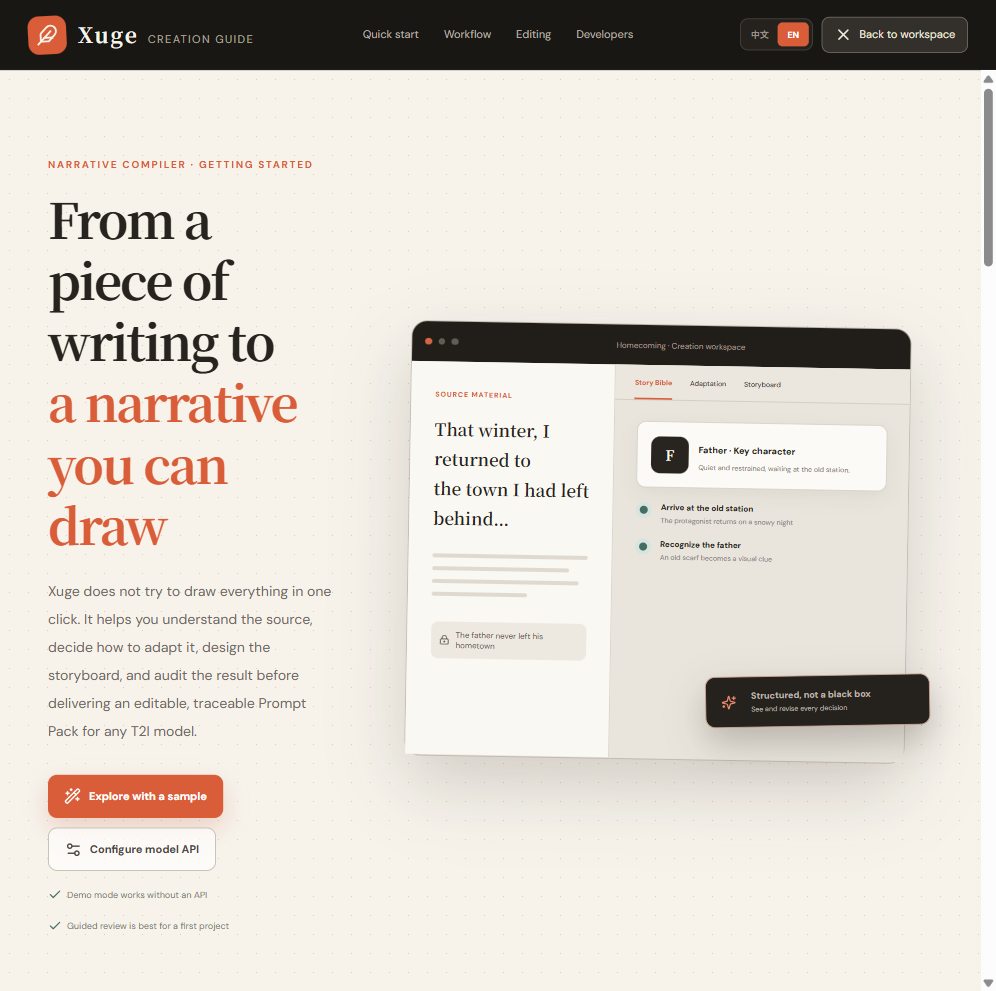
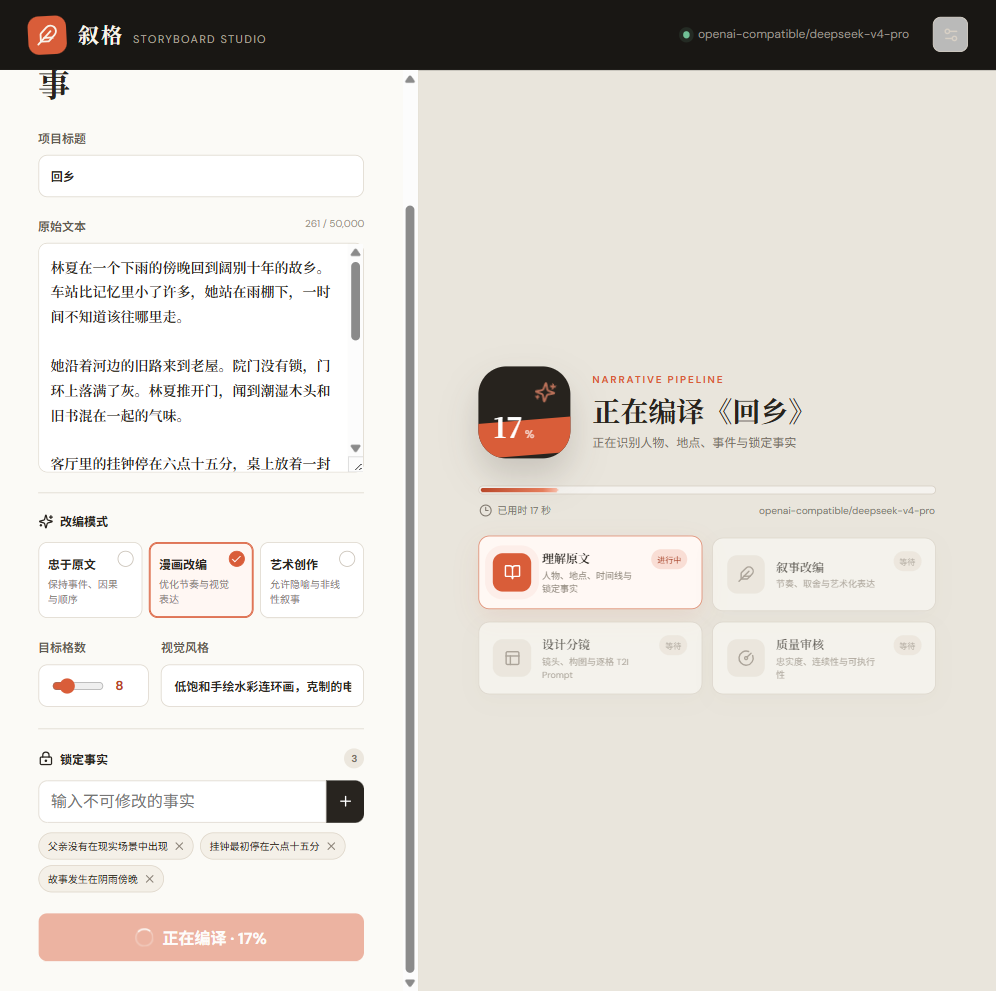
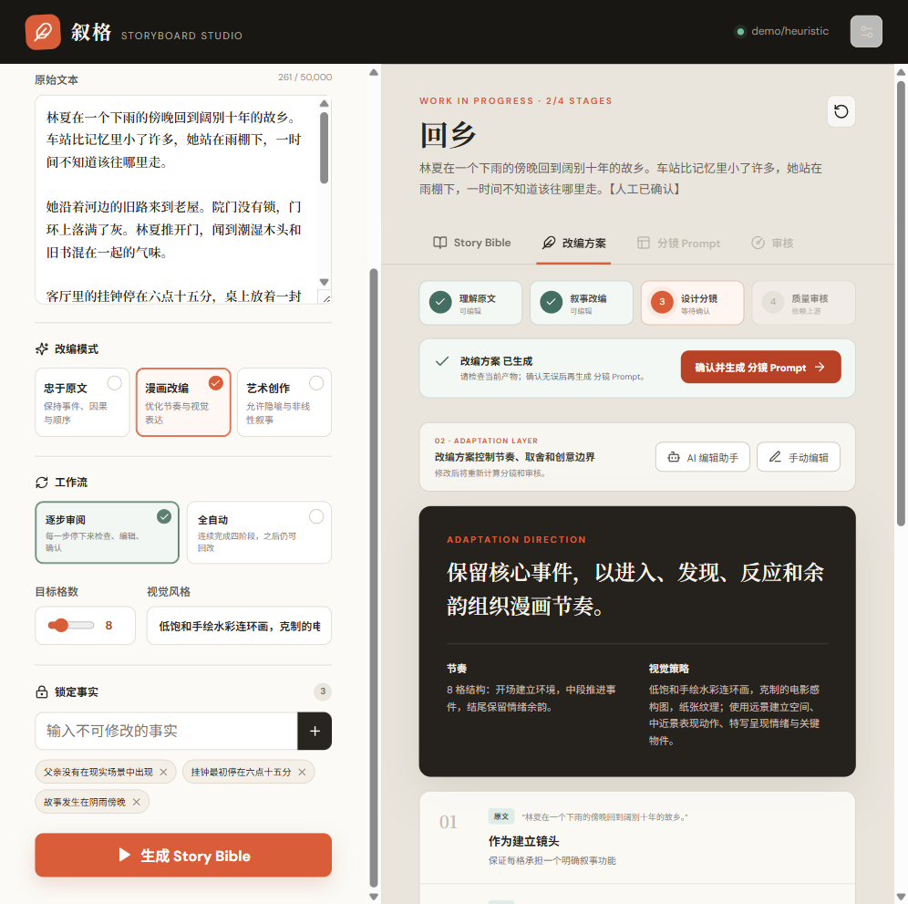
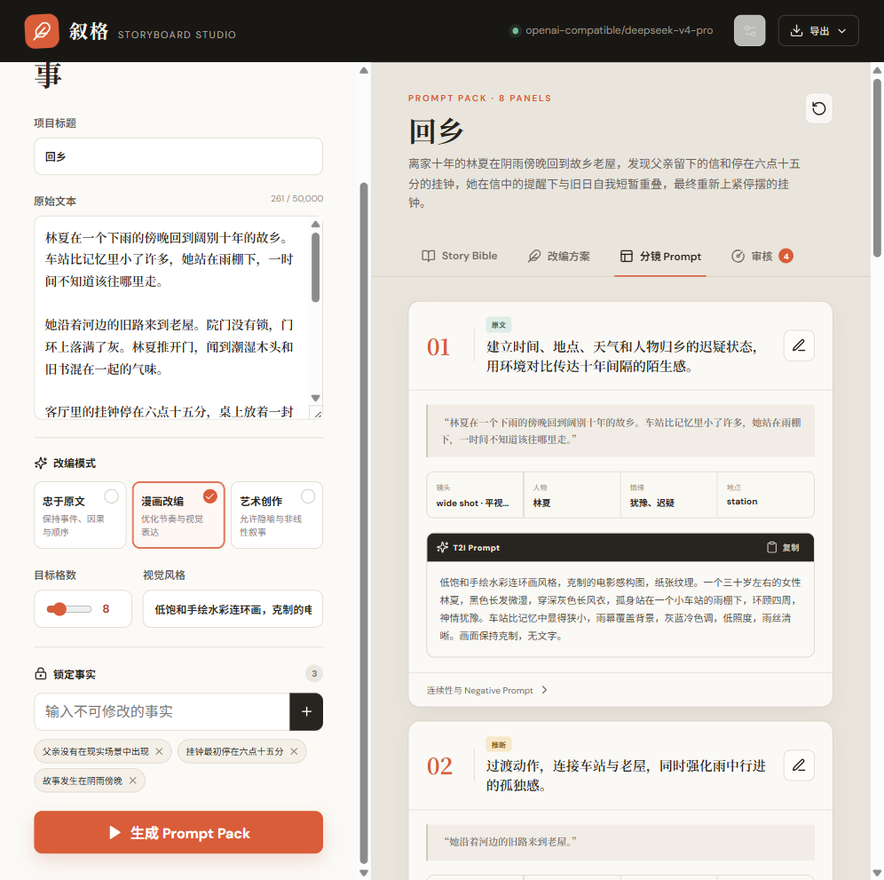
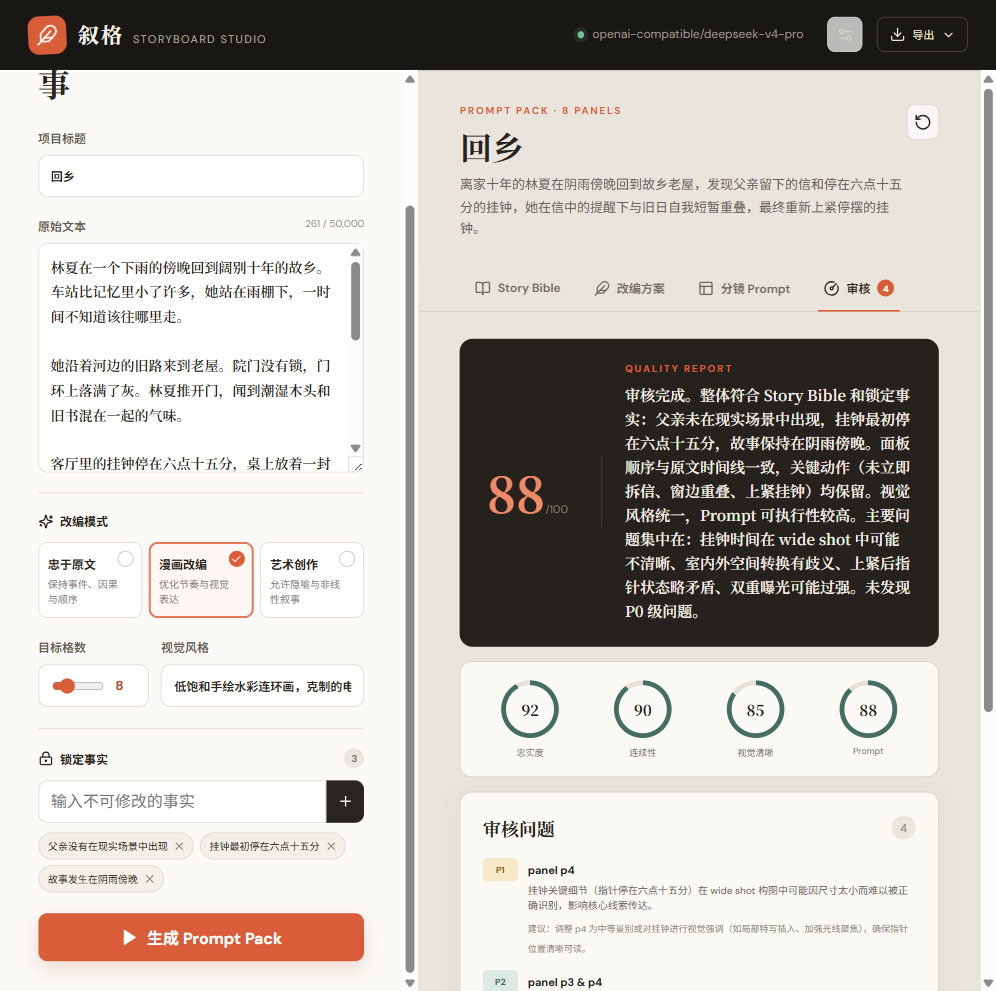
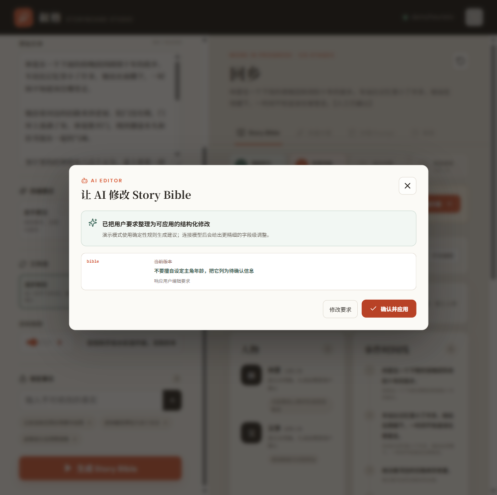
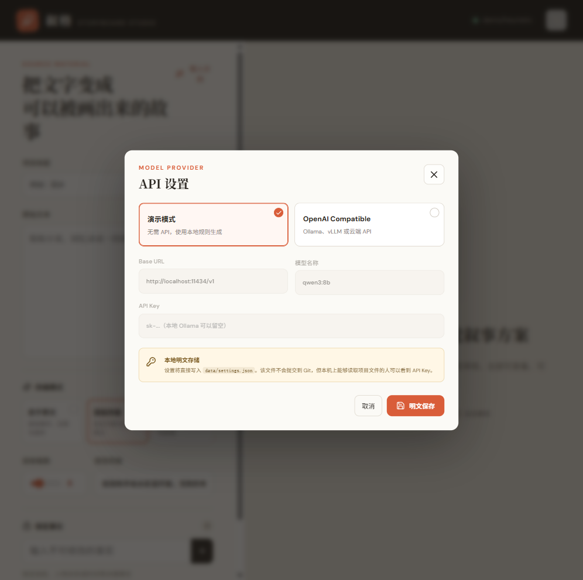

# Storyboard Studio: Turn messy writing into a coherent visual story

[简体中文](./README.zh-CN.md) · English

[](https://github.com/Shhaaawwww/xuge-storyboard-studio/actions/workflows/cross-platform.yml)

## Turn messy writing into a coherent visual story.

Xuge is an open-source narrative compiler for rough notes, fragmented memories, journals, memoirs, and unfinished fiction. It turns writing that is hard to follow into an editable visual blueprint: a Story Bible, Narrative Spine, scene plan, storyboard, reader-visible script, and panel-by-panel T2I prompt pack.

> Start with the mess. End with a story you can draw, direct, or generate.

Xuge does not generate images or final comic layouts. It makes the story understandable before it makes the story artistic, then exports prompts that can work with any T2I tool.

## See the workspace in action

<p align="center">
  
</p>

<p align="center"><em>Understand the source before asking an image model to draw it.</em></p>

<table>
  <tr>
    <td width="50%" valign="top">
      
      <strong>Visible pipeline</strong><br />
      Every stage is explicit, with a pause point in Guided mode.
    </td>
    <td width="50%" valign="top">
      
      <strong>Edit before you continue</strong><br />
      Inspect the adaptation plan, then regenerate only the downstream stages.
    </td>
  </tr>
  <tr>
    <td width="50%" valign="top">
      
      <strong>Prompt Pack</strong><br />
      Export panel-by-panel prompts ready for any T2I tool.
    </td>
    <td width="50%" valign="top">
      
      <strong>Quality audit</strong><br />
      A zero-context reader retells the visible story before fidelity, continuity, and prompt quality receive a score.
    </td>
  </tr>
  <tr>
    <td width="50%" valign="top">
      
      <strong>AI editing assistant</strong><br />
      Describe a change, review the structured proposal, and apply it only when it looks right.
    </td>
    <td width="50%" valign="top">
      
      <strong>Bring your own model</strong><br />
      Connect an OpenAI-compatible provider while keeping settings local to your machine.
    </td>
  </tr>
</table>

## From fragments to frames

A raw memory rarely arrives as a clean script. It jumps through time, leaves details uncertain, and mixes facts with impressions. Xuge separates those layers before turning them into visual decisions:

```text
Rough writing          fragments · jumps · missing details
    ↓
Story facts            characters · places · timeline · locked facts
    ↓
Narrative spine        protagonist · goal · obstacle · causality · resolution
    ↓
Visual blueprint       scenes · transitions · reader text · shots · continuity
    ↓
Prompt Pack            panel-by-panel prompts for any image model
```

- **Start with imperfect input** — no polished screenplay required.
- **Comprehension before artistry** — preserve the premise, causal chain, identities, time jumps, and ending before adding metaphor or visual flourish.
- **Audit what the reader sees** — a blind reviewer receives no source text, Story Bible, or hidden production notes; if it cannot retell the story, the pack cannot receive a passing score.
- **Control the creative distance** — stay faithful, adapt for comics, or take an artistic direction.
- **Keep the author in control** — review, edit, and regenerate each stage instead of accepting a black-box result.

- **Edit every artifact** — Story Bible, Adaptation Plan, storyboard, and prompt cards remain editable.
- **Regenerate with dependencies** — changing an upstream artifact marks the affected downstream stages for regeneration.
- **Edit with AI assistance** — describe a change in natural language, review the proposed diff, then decide whether to apply it.
- **Keep provenance visible** — distinguish source facts, reasonable inferences, and creative additions.
- **Resume after a refresh** — generated and edited projects are automatically saved to a local project library.
- **Switch the interface language** — use Xuge in English or Simplified Chinese without changing the language of your story artifacts.

## Workflow

```text
Source text
    ↓
Story Bible          characters · locations · timeline · locked facts
    ↓
Adaptation Plan      narrative spine · causal chain · sequence and panel budget
    ↓
Storyboard & Prompts transitions · reader text · shots · self-contained T2I prompts
    ↓
Quality Audit        cold-read comprehension · causality · chronology · fidelity · prompt quality
    ↓
Markdown Prompt Pack / JSON Project
```

Use **Guided mode** to pause after each stage for review and editing, or **Auto mode** to produce the complete package in one run. Editing the Story Bible invalidates every later stage; editing the Adaptation Plan invalidates the storyboard and audit; editing the storyboard invalidates the audit.

## Quick start

Install [Node.js](https://nodejs.org/) `20.19+` or `22.12+`, then download or clone this repository.

> **Downloaded a ZIP? Extract the entire archive first.** Do not run a launcher from inside the compressed ZIP folder. On first launch, Xuge installs its JavaScript dependencies and then opens the browser automatically.

### Platform launchers

| System | Start | Stop |
| --- | --- | --- |
| Windows | Double-click `start-xuge.bat` | Double-click `stop-xuge.bat` |
| macOS | Double-click `start-xuge.command` | Double-click `stop-xuge.command` |
| Linux | Run `./start-xuge.sh` | Run `./stop-xuge.sh` |

The shared cross-platform launcher installs dependencies on the first run, builds the current version, starts the API and web app in stable non-watching mode, waits for both services to become healthy, and opens the browser. Reading or editing source files cannot restart this launcher-managed API. Logs and launcher state stay in the ignored `.runtime/` directory.

The launchers look for Node.js in `PATH` and in common Windows, Homebrew, nvm, fnm, Volta, asdf, and mise locations. If Node.js is missing, the launcher keeps the error visible and opens the official download page.

If macOS or Linux removes executable permissions after downloading a ZIP, run:

```bash
chmod +x start-xuge.sh stop-xuge.sh start-xuge.command stop-xuge.command
```

If macOS blocks the downloaded launcher, Control-click `start-xuge.command`, choose **Open**, then confirm **Open** once. This authorizes that downloaded script without changing system-wide security settings.

### Universal command line

```bash
git clone https://github.com/Shhaaawwww/xuge-storyboard-studio.git
cd xuge-storyboard-studio
npm install
npm run app:start
```

Stop the background app with `npm run app:stop`. Developers can use `npm run dev` to keep both services attached to the terminal. Open [http://127.0.0.1:5173](http://127.0.0.1:5173). The built-in Demo Provider requires no API key; choose **Load sample** to explore the complete workflow. Use the language switch in the top bar to change the interface. Generated story artifacts follow the source text language, so changing the interface never rewrites existing creative work.

### Local project archive

Every completed stage and accepted edit is automatically saved. Open **Projects** in the top bar to resume or delete earlier work after refreshing the browser or restarting Xuge.

Projects are stored only on your machine in `data/archive.json`. Active job checkpoints use `data/jobs.json`. These files, `data/settings.json`, `.env`, runtime logs, and generated output are ignored by Git and must never be committed. Local data is not encrypted; do not use Xuge for sensitive source material on a shared or untrusted computer. Back it up by copying the `data/` directory while Xuge is stopped.

### Long-running job recovery

Xuge writes a local checkpoint after Story Bible, Adaptation Plan, Storyboard, and Audit. Running jobs never expire on a fixed timer. If the browser refreshes, it reconnects to the persisted job. If the app or computer stops unexpectedly, Xuge restores the last completed stage on the next launch and asks you to regenerate only the interrupted stage.

An in-flight model response cannot be reconstructed after the process itself is terminated, and the provider may already have charged for that request. Checkpoints prevent completed stages from being lost; they do not make an individual remote request resumable.

> `npm run dev` intentionally watches source files and restarts the development API after server-side edits. Use the platform launcher or `npm run app:start` for real, long-running generation. Do not use development mode for paid model runs.

## Connect a model

Open Settings in the app, select **OpenAI Compatible**, and enter:

- Base URL
- Model name
- API key

The provider must support `/chat/completions` and should support JSON object output. Xuge can connect to compatible hosted APIs, gateways, Ollama, or vLLM.

Settings are stored in plain text at `data/settings.json` on your machine. The file is ignored by Git, but it is not encrypted. You can also copy `.env.example` to `.env` and configure the same values there.

> **Local-use boundary:** this MVP is designed for a trusted, single-user computer. Do not expose it directly to the public internet. It does not yet include authentication, user isolation, or a production secret store.

## Outputs

- Editable Story Bible and Adaptation Plan
- Structured storyboard with individual T2I prompt cards
- Fidelity, continuity, visual clarity, and prompt-quality audit
- Local auto-save archive for resuming generated and edited projects
- Markdown Prompt Pack for human workflows
- JSON Project for agents, scripts, or downstream tools

## Current scope

- The Demo Provider demonstrates the product flow, not real story understanding.
- A source document is currently limited to 50,000 characters.
- Long-form, chapter-by-chapter processing is not yet implemented.
- Real-model results depend on valid structured JSON output from the selected model.
- Image generation and final comic layout remain deliberately model-agnostic.
- The interface supports English and Simplified Chinese. Generated artifacts follow the source text language.

## Development

```bash
npm run dev      # Start API and web app
npm run serve    # Build and run the stable non-watching app
npm run build    # Type-check and build the web app
npm test         # Run pipeline tests
```

```text
src/              React workspace and export tools
server/           Pipeline, prompts, providers, jobs, settings, and local archive
scripts/          Shared cross-platform launcher core
*.bat              Windows launchers
*.command          macOS double-click launchers
*.sh               macOS/Linux shell launchers
```

Contributions are welcome. See [CONTRIBUTING.md](./CONTRIBUTING.md) and [SECURITY.md](./SECURITY.md).

Released under the [MIT License](./LICENSE).
